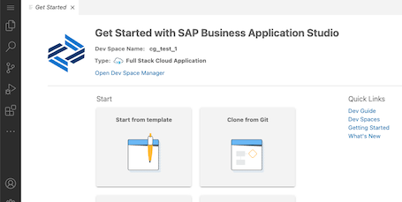
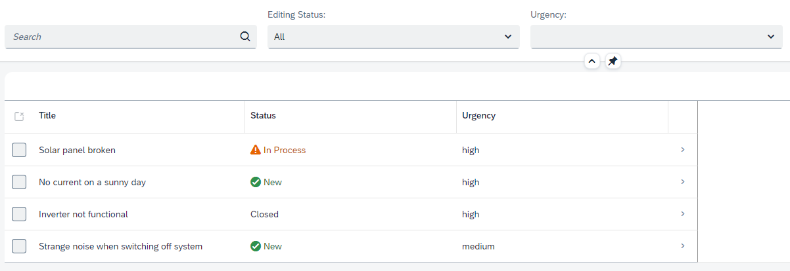

In the following we describe how to get started with the _Incidents Management_ application, which we use throughout the exercises.

## Set Up SAP Business Application Studio

1. **Start Google Chrome** (BAS runs best with that browser)
2. **Open** the URL of SAP Business Application Studio. We have prepared an account for you [here](https://lcapteched.eu10cf.applicationstudio.cloud.sap/index.html) -> open this page in a new browser tab
3. **Get your user credentials** - We have prepared test users for you [here](https://cap-enablement-team.launchpad.cfapps.eu12.hana.ondemand.com/a6f9aec4-7c3b-4059-a3b6-4b66229a7926.sapfecapcredentials.credentialsservice-0.0.1/index.html). -> open this page in a new browser tab. Retrieve a user by clicking the `Get fresh credentials` button. Take a note of the credentials as you may need them later.
4. **Log in** by copying the credentials from the previous step to the BAS logon screen
5. **Provide a name** for your dev space, for example `dev`
6. **Create a dev space** of type **Full Stack Cloud Application** (might take a few minutes).
7. **Enter the dev space** by clicking on it's title  → a page like this appears:

  

## Clone and Open the Project

**Open a terminal** (press <kbd>Control</kbd> <kbd>Shift</kbd> <kbd>\`</kbd> , type ` > Create New Terminal` in the search bar or use the main menu)


In the terminal, run:

```sh
cd projects
git clone --branch training https://github.com/SAP-samples/cap-sample-incidents-mgmt
```

Then open the project using the **Open Folder** command (<kbd>F1</kbd> > _Open folder_).
Select the cloned project folder _projects > cap-sample-incidents-mgmt_ like this and press _OK_:


In the new workspace, again **open a terminal**, and run

```sh
npm install
npm add @sap-cloud-sdk/http-client
npm install -g @sap/cds-dk
```

This installs the necessary modules for the `incidents` application plus the [SAP Cloud SDK HTTP Client](https://sap.github.io/cloud-sdk/docs/js/overview-cloud-sdk-for-javascript), which helps with remote communication.<br>

The `cds` command line tool is updated as well to the latest version.

## Inspect the Application

Let's see what we got in the project.  The conceptual domain model for this _Incidents Management_ application is as follows:

- *Customers* can create *Incidents* (either directly or via agents)
- *Incidents* have a title and a *Conversation* of several *Messages*


A condensed version in the [CDS language](https://cap.cloud.sap/docs/cds/cdl) is as follows:

```cds
entity Customers {
  key ID : UUID;
  name      : String;
}

entity Incidents {
  key ID : UUID;
  title        : String;
  customer     : Association to Customers;
  conversation : Composition of many {
    timestamp  : DateTime;
    author     : String;
    message    : String;
  };
}
```

> [Learn more about Domain Modeling in CAP](https://cap.cloud.sap/docs/guides/domain-modeling)


Now try the following:

1. Find `db/schema.cds` in the file explorer
2. Open it in CDS Text Editor.
3. Alternatively, use _Open with... > CDS Graphical Modeller_ in SAP Business Application Studio

<details>
<summary>Which entity is missing?</summary>

The _Customers_ entity is missing at the moment.

</details>

## Your Tasks

Your task in the following exercises is to
- Define _Customers_
- Not as a 'normal' local entity, though
- But as a projection on a remote entity of an SAP S/4HANA system
- So that at runtime the customer data comes from the remote system
- With as minimal load as possible to the remote system
- Integrate it nicely into the rest of the data model

## Run the Application

First things first, let's **run the application**.  In the terminal, execute in the `incidents` folder:

```sh
cds watch
```

> In the following exercises, always use the folder `cap-sample-incidents-mgmt` as **working directory** in the terminal (unless stated otherwise).  If you get errors like `no model found`, this usually means you are in the wrong folder.

In SAP Business Application Studio, wait for the little popup in the bottom right corner to appear.  Click **Open in a New Tab**:


It might be that the new browser tab is **blocked**.  If this happens, no worries:
- Unblock future popups from this host.  See the address bar for the little popup manager icon.
- Press <kbd>Ctrl+C</kbd> in the terminal, and run `cds watch` again.

> Tip: You can always open a _running_ application's tab using the _Ports Preview_ command.  Use <kbd>F1</kbd> and type _Ports_ to find the command.

The application should have come up with an address like `https://port4004-workspaces-ws-...applicationstudio.cloud.sap/`.

On the application's index page, go to **Incidents → Fiori preview**, which opens an SAP Fiori elements list page for the `Incidents` entity.  It should look like this:



> With regards to the UI screens that you see here: this is not a tutorial on SAP Fiori.  Instead, we use the minimal screens necessary to illustrate the relevant points.  For a full-fledged SAP Fiori Elements application using CAP, see the [SFlight application](https://github.com/SAP-samples/cap-sflight/).

## Summary

Now that you have a first version of the application running, continue to the [first exercise](1.-Importing-APIs.md).
